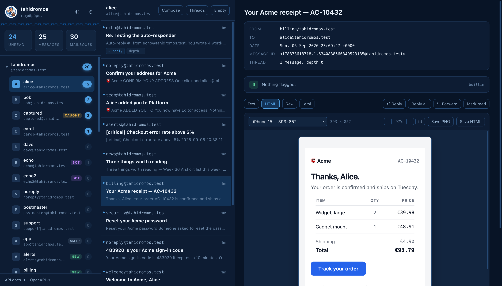
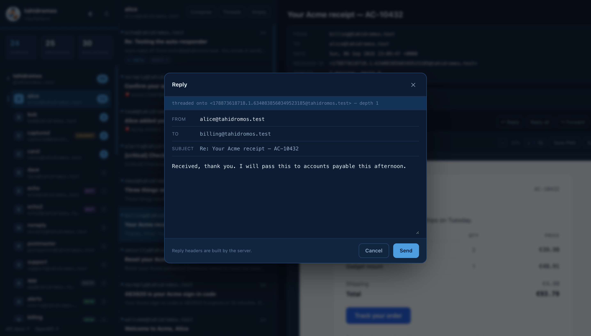
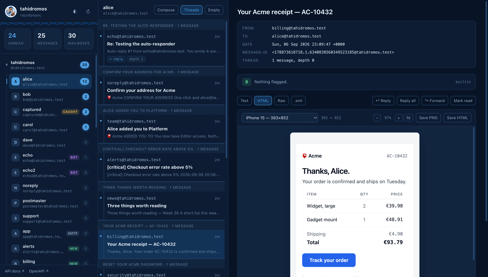
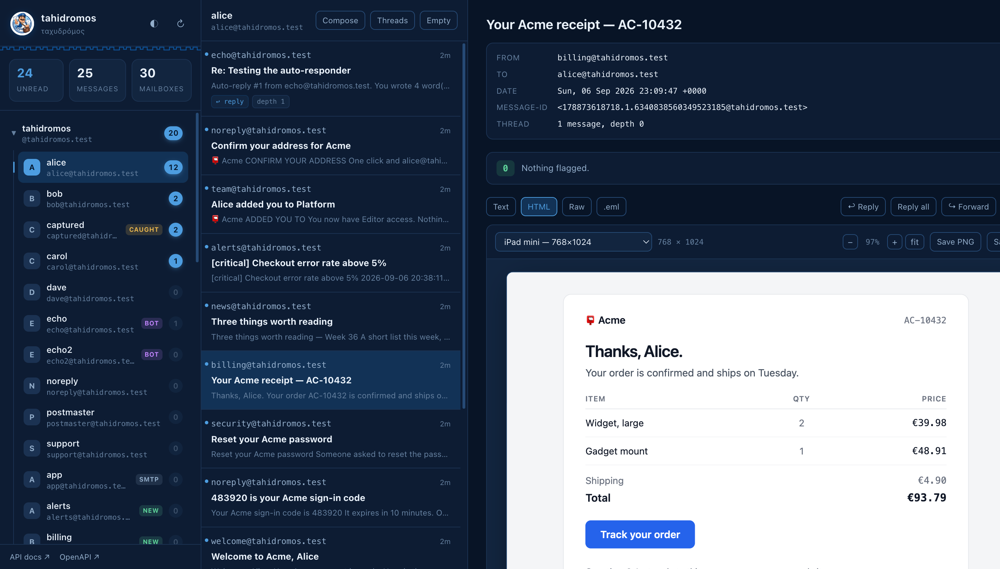
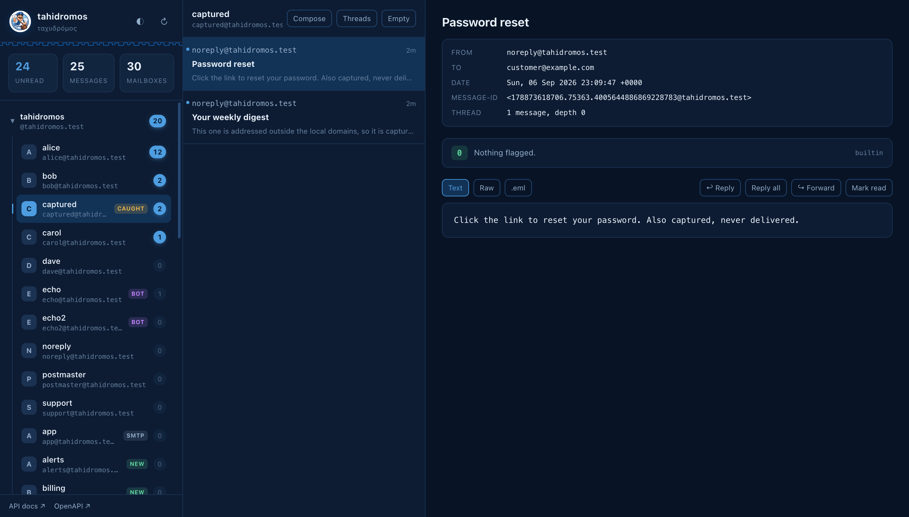
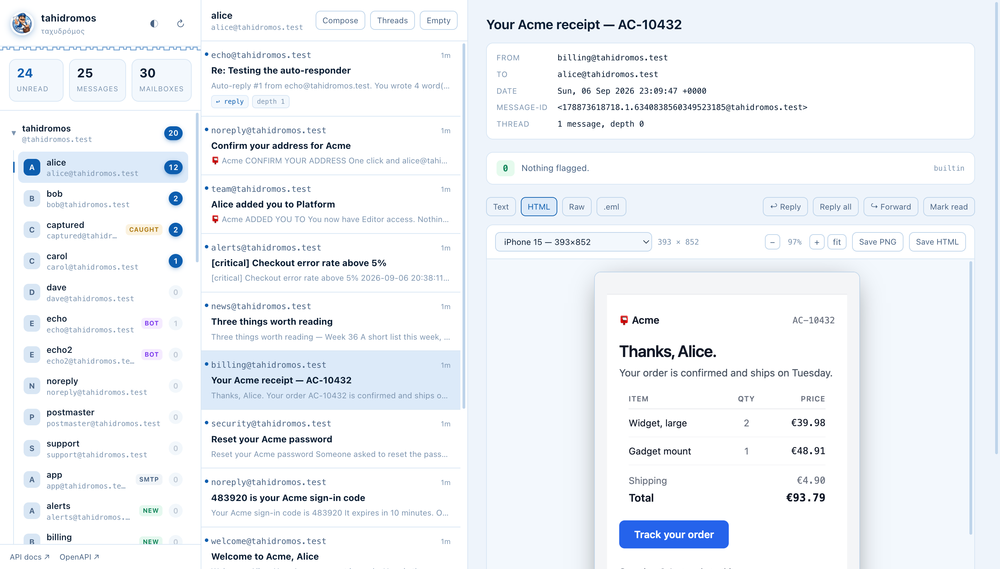

<div align="center">


# tahidromos

**A development mail server that can hold a conversation.**

*ταχυδρόμος* — Greek for **postman**

Real SMTP · Real IMAP · Real reply threads · One container · No login

</div>

---

Mailpit and MailHog are excellent, but they are *sinks*: mail goes in and never
comes out. You cannot reply to a message in a sink, so you cannot test the one
thing email chat apps are made of — a thread.

tahidromos is a mail server with real mailboxes. Send a message to
`bob@tahidromos.test`, read it over IMAP, reply to it, reply to the reply, and
watch `In-Reply-To` and `References` build a proper RFC 5322 chain — with
nothing ever reaching the real internet.

It is written from scratch on the Python standard library. There is no Postfix,
no Dovecot, no third-party mail server underneath — just one image you run.



## Quick start

```sh
curl -O https://raw.githubusercontent.com/pamfilico/tahidromos/main/docker-compose.yml
docker compose up -d
```

Or without compose at all:

```sh
docker run -d --name tahidromos \
  -p 1025:25 -p 1587:587 -p 1143:143 -p 8080:8080 \
  ghcr.io/pamfilico/tahidromos
```

That is the whole setup. No config files, no account creation, no certificates,
and no login screen anywhere. Open **<http://localhost:8080>**.

| | |
| --- | --- |
| Inbox browser + REST API | <http://localhost:8080> |
| SMTP — no credentials needed | `localhost:1025` |
| Submission — authenticated | `localhost:1587` · TLS `localhost:1465` |
| IMAP | `localhost:1143` · TLS `localhost:1993` |

Ten mailboxes exist immediately — `alice`, `bob`, `carol`, `dave`, `support`,
`sales`, `noreply`, `postmaster`, `echo`, `echo2` — all at `@tahidromos.test`
with the password **`password`**.

**You do not have to create anyone.** Send to `whoever@tahidromos.test` and
the mailbox is created on delivery, appears in the sidebar tagged `NEW`, and
can be read over IMAP with the same password. Random per-test addresses work
for the same reason.

Point your app at it:

```env
SMTP_HOST=localhost
SMTP_PORT=1025            # or 1587 with SMTP AUTH
SMTP_USER=noreply@tahidromos.test
SMTP_PASSWORD=password
IMAP_HOST=localhost
IMAP_PORT=1143
```

## Prove it works

```sh
python3 examples/send_email.py
```

```
→ connecting to SMTP localhost:1587
→ sent <17887…@tahidromos.test>
→ waiting for delivery to bob@tahidromos.test over IMAP localhost:1143
✓ delivered — uid 1
```

And the part a mail sink cannot do:

```sh
python3 examples/reply_conversation.py --turns 6
```

```
--- final message ---------------------------------------------
Subject     : Re: Let's talk
In-Reply-To : <17887…@tahidromos.test>
References  : 5 ancestors
✓ 6 messages, one unbroken thread rooted at <17887…@tahidromos.test>
```

Both scripts use nothing but `smtplib` and `imaplib`, so they double as worked
examples of how your own app should thread its replies.

## Three ways to reply

### 1. By hand, in the browser

Pick a mailbox in the sidebar, open a message, hit **Reply**. The server builds
`In-Reply-To` and `References` from the original, so the thread is correct by
construction — the composer shows you exactly what it will hang the reply onto.



Messages group into threads with one click, and every message shows its
position in the chain:



### 2. From your test suite

```sh
pip install tahidromos-client
```

The fixtures register themselves — no conftest wiring:

```python
def test_signup_sends_a_confirmation(inbox, client):
    client.post("/register", json={"email": inbox.address})

    message = inbox.wait(subject_contains="Confirm your address")

    assert message.link.startswith("https://")   # the magic link
    assert message.code is not None              # the one-time code
```

`inbox` is a mailbox created for that test alone and deleted afterwards, so
parallel workers cannot read each other's mail. `inbox.wait()` long-polls the
server, so **no test ever needs `sleep()`** — the two usual causes of a flaky
email test, both gone.

Testing that your app handles an *incoming* reply:

```python
def test_we_handle_an_incoming_reply(inbox, echo_bot):
    sent = inbox.send(to=echo_bot, subject="Ticket #42", text="Is this fixed?")

    reply = inbox.wait(in_reply_to=sent["message_id"])
    assert reply.subject == "Re: Ticket #42"

    inbox.reply(reply, "Thanks, closing it.")     # reply to the reply
```

For JavaScript and TypeScript:

```sh
npm install --save-dev @pamfilico/tahidromos
```

```js
import { test, expect } from "@pamfilico/tahidromos/playwright";

test("a new user can sign in from the email", async ({ page, inbox }) => {
  await page.goto("/signup");
  await page.fill("#email", inbox.address);
  await page.click("#register");

  await page.goto(await inbox.waitForLink({ subjectContains: "Confirm" }));
  await expect(page.locator("h1")).toHaveText("Welcome");
});
```

Same idea: `inbox` belongs to that test, `waitForLink` long-polls. There are
`waitForCode` and `waitFor` too, plus `signInWithMagicLink` and
`enterOneTimeCode` for the two flows most apps share. Works in Cypress and
Vitest as well — the Playwright part is optional.

Or drive it over plain HTTP from any language:

```sh
curl -sX POST localhost:8080/inboxes -d '{"prefix":"signup","run_id":"ci-42"}'
curl -sX POST localhost:8080/wait    -d '{"user":"signup-a1b2c3@tahidromos.test","has_code":true}'
curl -sX DELETE 'localhost:8080/inboxes?run_id=ci-42'      # teardown
```

### 3. Automatically, with the echo bots

`echo@` and `echo2@` are ordinary mailboxes with an auto-responder attached.
They reply to anything they receive, threading correctly, so your app always
has a conversation partner. Mail `echo`, get an answer, reply to that answer,
get another one.

Send one bot a message *from* the other and they volley on their own until
`BOT_MAX_DEPTH` stops them — the reply-to-a-reply-to-a-reply case, end to end,
with no human in the loop:

```
echo  replied depth=1 to=echo2  subject='Re: ping pong'
echo2 replied depth=2 to=echo   subject='Re: ping pong'
echo  replied depth=3 to=echo2  subject='Re: ping pong'
…
echo2 replied depth=8 to=echo   subject='Re: ping pong'   ← stops at the limit
```

## Forwarding

A forward is not a reply, and getting that distinction right is what makes a
forwarded conversation testable:

```sh
curl -sX POST localhost:8080/forward -H 'content-type: application/json' -d '{
  "user": "bob", "uid": "3", "to": "carol", "note": "Carol — see below."
}'
```


The server adds the `Fwd:` prefix (once, however many hops), builds the
`---------- Forwarded message ----------` block with the original From, Date,
Subject and To, and **carries the attachments across**. It sets
`X-Forwarded-Message-Id` pointing at the original, and no `In-Reply-To` —
because a forward is not a reply. `References` is carried, so when Carol
replies, her reply still threads back to Alice's original:

```
alice → bob          Q3 report
bob   → carol        Fwd: Q3 report          (no In-Reply-To, References kept)
carol → bob          Re: Fwd: Q3 report      (In-Reply-To = the forward)
bob   → carol        Re: Fwd: Q3 report      (depth 3, root still Alice's message)
```

`"mode": "attachment"` attaches the original as `message/rfc822` instead of
quoting it, for when the bytes have to survive untouched.

### Mailboxes that forward on their own

A mailbox can forward everything it receives, the way an alias does:

```yaml
mailboxes:
  - name: helpdesk
    forward_to: [support@shop.test]     # keeps a copy as well
  - name: contact
    forward_to: [support@shop.test]
    keep_copy: false                    # a pure redirect
```

`GET /forwards` lists the rules. Two mailboxes pointing at each other cannot
run away: every forward carries a hop count and the path of mailboxes it has
already been through, and `MAIL_MAX_FORWARDS` (default 5) caps the rest.

## Magic links and one-time codes

Every message arrives with the parts an end-to-end test actually asserts on,
already extracted:

| Field | What it holds |
| --- | --- |
| `stripped_text` | The body with the quoted thread and signature removed |
| `link` · `links` | The first link, and all of them |
| `code` | The one-time code, if the message has one |

The extraction is careful about the things that trip up a naive regex: a
`?token=abc123` inside a URL is not a one-time code, `Your code is 483920`
is one even though a word sits between the label and the digits, and an
HTML-only message still yields both.

## Email templates

Eight production-shaped templates ship with the server — table layouts,
inline styles, preheaders, a plain-text alternative for each:

`welcome` · `otp` · `password_reset` · `receipt` · `digest` · `alert` ·
`invite` · `verify_email`

```sh
curl -sX POST localhost:8080/templates -H 'content-type: application/json' -d '{
  "name": "receipt", "to": "alice", "context": {"name": "Alice"}
}'
```

Anything in `context` overrides the defaults, and values are HTML-escaped, so
a template cannot be injected through its own data.

### Previewing at real device sizes

Open the HTML tab on any message and pick a device. Thirteen presets: five
phones, three tablets, two desktops, and the three widths email actually
breaks at — Outlook's 600, Gmail's 640, Apple Mail's 700.



**Save PNG** rasterises exactly what you see, at the selected width, entirely
in the browser. **Save HTML** and **.eml** download the parts. Handy for
attaching a render to a pull request, or diffing a template against last week.

### Authoring in React Email

Templates are plain HTML files, so you can edit them directly. If you would
rather write components, `templates/react-email/` is a full
[React Email](https://react.email) project whose export writes into the same
directory:

```sh
cd templates/react-email
npm install
npm run dev        # live preview at :3030 while you edit
npm run export     # write the HTML the server serves
```

The components keep `{{ handlebars }}` placeholders, so React Email is the
design tool and the server still does the data binding. `invite` and
`verify_email` are built this way; the other six are handwritten. Both end up
as the same thing.

## Spam scoring

Every message can be scored, with the rules that fired and why:

```sh
curl -s localhost:8080/messages/alice/7/spam
```

```json
{
  "engine": "builtin", "score": 8.5, "verdict": "spam",
  "hits": [
    {"rule": "FROM_DISPLAY_SPOOF", "weight": 3.0,
     "description": "Display name shows 'support@bank.test' but the address is 'attacker@evil.test'"},
    {"rule": "SUBJECT_ALL_CAPS", "weight": 1.5, "description": "Subject is mostly capitals"},
    {"rule": "URL_SHORTENER", "weight": 1.2, "description": "Link through a shortener (bit.ly)"}
  ]
}
```

The built-in scorer needs nothing installed and covers the own-goals worth
catching: shouting subjects, display-name spoofing, links to bare IPs, hidden
keyword stuffing, bulk mail with no `List-Unsubscribe`, executable
attachments. Every template that ships here scores **0** — a scorer that
flags good mail is worse than no scorer, and there is a test asserting it.

For a verdict closer to production, run [Rspamd](https://rspamd.com)
alongside — it is a real filter, actively developed:

```sh
docker compose -f docker-compose.yml -f docker-compose.rspamd.yml up -d
```

`/spam` then answers from Rspamd instead. Nothing else changes.

## Inbound webhooks, without a tunnel

Postmark, SendGrid and Mailgun all POST incoming mail at your application.
Testing that normally means a public endpoint and an ngrok tunnel, because
the usual dev mail tools cannot receive mail at all.

Here delivery is local, so tahidromos can just POST the same shape at you:

```sh
INBOUND_WEBHOOK_URL=http://host.docker.internal:3000/webhooks/inbound \
INBOUND_WEBHOOK_FORMAT=postmark \
docker compose up -d
```

| Variable | Meaning |
| --- | --- |
| `INBOUND_WEBHOOK_URL` | Where to POST. Unset means the feature is off |
| `INBOUND_WEBHOOK_FORMAT` | `postmark` · `sendgrid` · `mailgun` · `raw` |
| `INBOUND_WEBHOOK_ONLY` | Regex — only POST for matching recipients |
| `INBOUND_WEBHOOK_SECRET` | Sent as `X-Tahidromos-Signature` |

The Postmark shape includes `MailboxHash` (so `support+ticket42@` gives you
`ticket42`) and `StrippedTextReply`; Mailgun gets `stripped-text`. Failed
POSTs retry with backoff, and `/webhook` reports what happened.

## Awkward messages, on demand

Ten canned shapes that are tedious to build by hand and break naive parsers:

```sh
curl -sX POST localhost:8080/scenarios -d '{"name":"bounce","to":"alice","seed":42}'
```

`bounce` (a real RFC 3464 report) · `newsletter` (List-Unsubscribe + HTML) ·
`html_only` · `otp` · `deep_reply` (three levels of quoting) · `attachment` ·
`unicode` · `auto_reply` · `signed` (DKIM/SPF/DMARC headers) · `large`

With a `seed` the bytes are identical every run, so they work as snapshot
fixtures.

## For AI agents

An agent that handles email needs somewhere to practise. The alternatives are
production inbox services: real addresses, real delivery, a bill, and an
internet connection.

```sh
pip install tahidromos-mcp
claude mcp add tahidromos -- tahidromos-mcp
```

Sixteen MCP tools over the same API: `create_inbox` for a disposable address,
`wait_for_email` that blocks on the server instead of polling, `send_email`,
`reply_to_email`, `forward_email`, `echo_bot_address` for a counterpart that
always answers, `send_test_scenario` for deliberately awkward mail, and
`check_spam_score`.

A whole session, offline and free:

```
create_inbox(purpose="support")               → support-a1b2c3@tahidromos.test
echo_bot_address()                            → echo@tahidromos.test
send_email(…, "Ticket #42", "Is this fixed?")
wait_for_email(address, in_reply_to=<id>)     → the reply, correctly threaded
reply_to_email(address, uid, "Thanks.")
cleanup()
```

Replies and forwards build their own `In-Reply-To`, `References` and prefixes,
so an agent never constructs mail headers to hold a threaded conversation.
See [`clients/mcp/`](clients/mcp).

## Nothing escapes

Mail addressed outside the local domains is never sent onward. The recipient
is rewritten to the `captured` mailbox while the original `To:` header is left
untouched, so you can still see exactly who it was meant for.



If your app accidentally mails a real customer address in development, you
find it here and nowhere else.

## REST API

Interactive docs at <http://localhost:8080/docs>.

| Method | Path | Purpose |
| --- | --- | --- |
| `GET` | `/health` · `/config` · `/apps` | Status, connection details, app config |
| `GET` | `/overview` | Every app and mailbox with unread/total counts |
| `POST` `DELETE` | `/inboxes` | Throwaway mailbox · tear down a whole run |
| `GET` `POST` | `/accounts` | List mailboxes · create a named one |
| `GET` | `/messages/{user}` | List (`?unseen=true`, `?mailbox=Sent`) |
| `GET` | `/messages/{user}/{uid}` | One message, parsed, with links and code |
| `GET` | `…/raw` · `…/html` · `…/eml` | The source, the HTML part, a download |
| `GET` | `…/spam` | Score it, with the rules that fired |
| `PATCH` | `/messages/{user}/{uid}` | Mark read or unread |
| `DELETE` | `/messages/{user}` | Empty a mailbox between test cases |
| `GET` | `/threads/{user}` | Grouped by `References` |
| `POST` | `/send` · `/reply` · `/forward` | Send · reply · forward, headers handled for you |
| `GET` | `/forwards` | Mailboxes that forward everything on |
| `POST` | `/wait` | Block until a matching message arrives |
| `GET` `POST` | `/templates` | List · render and send |
| `GET` `POST` | `/templates/{name}/preview` | Rendered HTML, without sending |
| `GET` `POST` | `/scenarios` | List · deliver a canned message |
| `GET` `POST` | `/spam` | Engines available · score anything |
| `POST` | `/parse` | Strip quotes, find links and codes |
| `POST` | `/conversation` | Generate a real multi-turn thread |
| `GET` | `/webhook` | Inbound webhook status |

Reading a message never changes its flags — the UI fetches with `BODY.PEEK[]` —
so browsing a mailbox cannot perturb a test that is waiting on an unread count.

## In CI

```yaml
jobs:
  test:
    runs-on: ubuntu-latest
    services:
      mail:
        image: ghcr.io/pamfilico/tahidromos
        ports: ["1025:25", "1587:587", "1143:143", "8080:8080"]
        options: >-
          --health-cmd "python -c \"import urllib.request;urllib.request.urlopen('http://127.0.0.1:8080/health')\""
          --health-interval 5s --health-retries 12
    steps:
      - uses: actions/checkout@v4
      - run: pip install tahidromos-client pytest
      - run: pytest        # the fixtures find it at localhost:8080
```

Nothing to install, nothing to configure, and the service is healthy before
the first test runs.

## Configuration

Every setting has a working default.

**Nothing here is required.** Every feature above — templates, spam scoring,
scenarios, disposable inboxes, device previews, the echo bots — works with the
zero-configuration `docker run`. The only two features that need a variable are
the ones that must know about something outside the container: the inbound
webhook (where to POST) and Rspamd (where it lives). Both say so when they are
off, and both are one variable.

| Variable | Default | Meaning |
| --- | --- | --- |
| `MAIL_DOMAIN` | `tahidromos.test` | Primary local domain |
| `MAIL_LOCAL_DOMAINS` | *(app domains)* | Extra domains to deliver locally |
| `MAIL_ACCOUNTS` | `alice,bob,carol,…` | Seeded mailboxes; `user` or `user:password` |
| `MAIL_DEFAULT_PASSWORD` | `password` | Shared password for seeded mailboxes |
| `MAIL_AUTO_CREATE` | `true` | Create unknown local mailboxes on first delivery |
| `MAIL_MAX_FORWARDS` | `5` | Hop limit for mailboxes that forward on |
| `BOT_ENABLED` | `true` | Run the auto-responders |
| `BOT_ACCOUNTS` | `echo,echo2` | Which mailboxes auto-reply |
| `BOT_MODE` | `echo` | `echo` · `mirror` · `ack` · `counter` |
| `BOT_MAX_DEPTH` | `8` | Where a bot-to-bot chain stops |
| `ENABLE_TLS` | `true` | Generate a self-signed cert and open 465/993 |
| `INBOUND_WEBHOOK_URL` | *(off)* | POST every delivery at your app |
| `INBOUND_WEBHOOK_FORMAT` | `postmark` | `postmark` · `sendgrid` · `mailgun` · `raw` |
| `RSPAMD_URL` | *(off)* | Score with Rspamd instead of the built-in rules |

Because unknown local addresses are created on first delivery, random
per-test addresses like `user-8f21a@tahidromos.test` just work.

## Light and dark

Greek flag blue on an Aegean night, or on white. The choice is remembered.



## Development

```sh
make dev        # build the image from this checkout and run it
make test       # run the whole suite against the running server
make seed       # fill it with realistic conversations and templates
make templates  # re-export the React Email templates
make logs
make clean      # delete every mailbox and message
```

`make help` lists everything.

### Tests

The suite is deliberately written against plain `smtplib`, `imaplib` and
`requests` rather than the project's own code, so it proves the *server* works
rather than that the helpers agree with themselves.

```
tests/test_delivery.py             delivery, CC, plus-addressing, TLS, capture
tests/test_threading.py            replies, replies to replies, 10-deep chains
tests/test_api.py                  the REST harness
tests/test_multiapp.py             per-app domains, credentials, isolation
tests/test_echobot.py              auto-responders and bot-to-bot threading
tests/test_ui.py                   the mailbox browser and its data
tests/test_templates.py            all eight templates render and deliver
tests/test_spam.py                 true positives, and zero false positives
tests/test_inbound_and_scenarios.py inboxes, scenarios, extraction, webhooks
tests/test_forwarding.py           forwards, replies to forwards, rules, loops
tests/test_client_fixtures.py      the pytest fixtures users actually write with
tests/test_mcp.py                  the MCP tools, driven through call_tool
```

166 tests, about a minute, plus 12 for the JavaScript client.

### What is inside

| Module | Role |
| --- | --- |
| `tahidromos/smtp.py` | SMTP + submission server (RFC 5321, AUTH, STARTTLS) |
| `tahidromos/imap.py` | IMAP4rev1 server (RFC 3501, UID commands, IDLE) |
| `tahidromos/store.py` | SQLite message store: mailboxes, UIDs, flags |
| `tahidromos/message.py` | Message building and the three rules of threading |
| `tahidromos/router.py` | Delivery, auto-creation, and the capture safety net |
| `tahidromos/bot.py` | Auto-responders |
| `tahidromos/config.py` | Multi-app configuration |
| `tahidromos/api.py` | REST API and the mailbox browser |
| `tahidromos/emailtemplates.py` | Template rendering, no template engine needed |
| `tahidromos/extract.py` | Quote stripping, links, one-time codes |
| `tahidromos/scenarios.py` | Ten reproducible awkward messages |
| `tahidromos/spam.py` | Heuristic scoring, and the Rspamd client |
| `tahidromos/webhook.py` | Provider-shaped inbound webhooks |
| `clients/python/` | `tahidromos-client` — the pytest fixtures |
| `clients/node/` | `@pamfilico/tahidromos` — Playwright fixtures |
| `clients/mcp/` | `tahidromos-mcp` — a disposable inbox for AI agents |

Four runtime dependencies: FastAPI, uvicorn, PyYAML and cryptography. The mail
servers, the spam scorer, the template renderer and the extraction all use only
the standard library. Node is needed only if you choose to author templates in
React Email, and never at runtime.

## Not for production

Self-signed certificates, plaintext authentication, no spam filtering, no
SPF/DKIM/DMARC checks, and an open relay on port 25 inside the container
network. Every one of those is a deliberate choice to make development
frictionless, and a reason never to expose this to the internet.

## Name

*ταχυδρόμος* (tahidromos) — Greek for **postman**. Hence the fellow at the
top, the flag-blue palette, and the meander under the sidebar header.

## License

MIT
